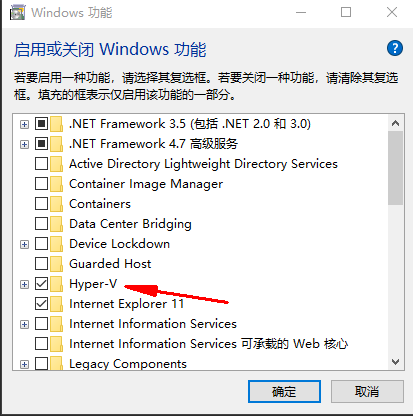
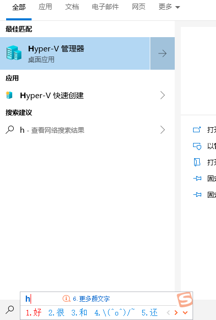
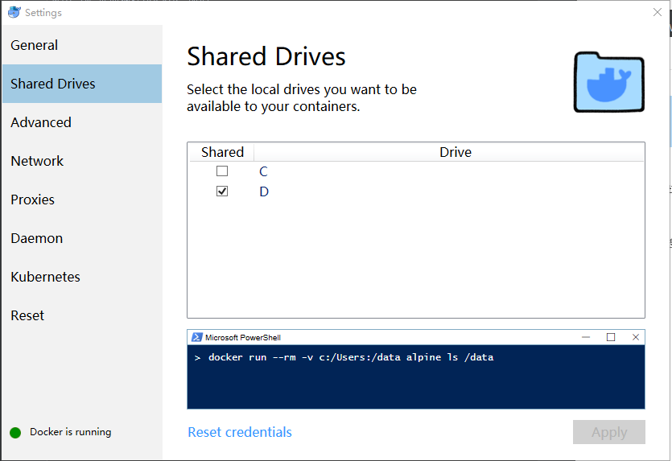

# docker-lnmp-win
win 10 本地搭建docker 环境

####### 前置条件 安装  [docker for win](https://hub.docker.com/editions/community/docker-ce-desktop-windows)
- 首先win 控制面板->程序和功能->启动或关闭window功能

- 重启电脑 后按住win +s 输入 hyper 出现下面图片则开启成功

- 下载  docker for win 后一直下一步安装后如图：

- 共享磁盘 勾选需要选择的磁盘后输入本地账号密码即可
- 由于国外原因无法访问docker镜像 所以需要加速 可以在阿里云注册 私人镜像 这是[我的](https://i1el1i0w.mirror.aliyuncs.com)

- 进入共享磁盘 克隆此项目 cd docker-lnmp 目录 执行 docker-compse up -d 几分钟后即可访问项目
- 将 127.0.0.1  local.demo.com 加入window host 打开浏览器 输入 local.demo.com 即可访问项目

##### docker 说明
- www 是项目的目录 demo
- conf 是所有配置文件的目录 nginx php
- log  nginx php 日志生成目录
- env  是配置log conf www 目录的环境变量文件可以自行配置
- Dockerfile 是php的镜像构建文件 可以自己加拓展
- md-image md的图片目录

##### 每次修改nginx php 配置需要重启容器 docker-compse restart php72/nginx

###### 有问题一起讨论

####### k8s项目  docker_for_win_k8s

##### 联系方式：
- wechat: guanchaoguo0 

